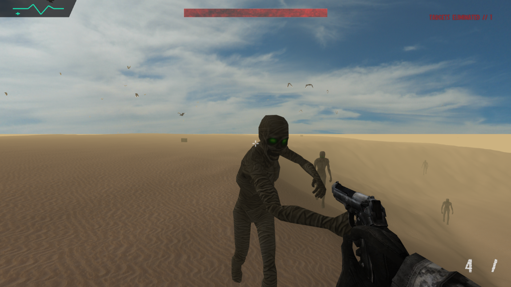

# 🏜️ PHANTOM DUNES

**Phantom Dunes** is an immersive 3D survival game built purely in Python, pushing the boundaries of `PyOpenGL` and `Pygame`. Stranded in a relentless, fog-shrouded desert, you must fend off waves of supernatural entities. Manage your ammunition, utilize your arsenal, and see how long you can survive the endless dunes before the connection drops.



---

## ⚡ Features

- **Custom 3D Engine:** Built with PyOpenGL, featuring procedural terrain collision, custom 3D model parsing (.obj/.mtl loaders), animated textures, and dense desert fog.
- **Cinematic UI:** Fully responsive premium overlays including a stylized terminal boot sequence, perfectly centered loading screen, and a brutal high-contrast "SIGNAL LOST" game over interface.
- **Entity AI & Combat:** Hostile phantoms and enemies that navigate the terrain with custom animations and collision meshes.
- **Immersive Audio:** Integrated sounds using Pygame Mixer for gunshots, damage impacts, and chilling ambient effects.

---

## ⚙️ Installation & Setup

If you are setting this up on a new system, follow these exact steps to get the game running perfectly:

1. **Clone the Repository**:
   ```bash
   git clone https://github.com/lipon101/PhantomDunes.git
   cd PhantomDunes
   ```

2. **Create a Virtual Environment** (Recommended):
   ```bash
   python -m venv .venv
   ```

3. **Activate the Virtual Environment**:
   - **Windows (Command Prompt):** `.venv\Scripts\activate.bat`
   - **Windows (PowerShell):** `.\.venv\Scripts\Activate.ps1`
   - **Mac/Linux:** `source .venv/bin/activate`

4. **Install Dependencies**:
   ```bash
   pip install PyOpenGL pygame
   ```

5. **Boot the Game**:
   ```bash
   python game.py
   ```

---

## 🎮 Controls

| Action | Key Binding |
| :--- | :--- |
| **Movement** | `W` `A` `S` `D` |
| **Look / Shoot** | `Mouse` / `Left Click` |
| **Reload** | `R` |
| **Jump** | `Spacebar` |
| **Sprint** | `Left Shift` (Hold) |
| **Reboot / Respawn**| `Enter` (When killed) |
| **Save / Load** | `F1` (Save) / `F2` (Load state) |
| **Exit Game** | `ESC` |

---

## 🔓 Developer Cheat Codes

Activate these by simply typing them on your keyboard while deeply immersed in-game.

| Code | Status Effect |
| :--- | :--- |
| `massacre` | Instantly eliminates all current enemies on the map |
| `hackmag` | Infinite magazine size (No reloading required) |
| `maxa` | Infinite backup ammo |
| `rocket` | Disables gravity |
| `flash` | Player speed boost |
| `neverdie` | Perfect Invincibility |
| `slamdunk` | Massive jump height |
| `reset` | Removes all active cheats |

---

<p align="center">
  <i>"CONNECTION TERMINATED // SIGNAL LOST"</i>
</p>
